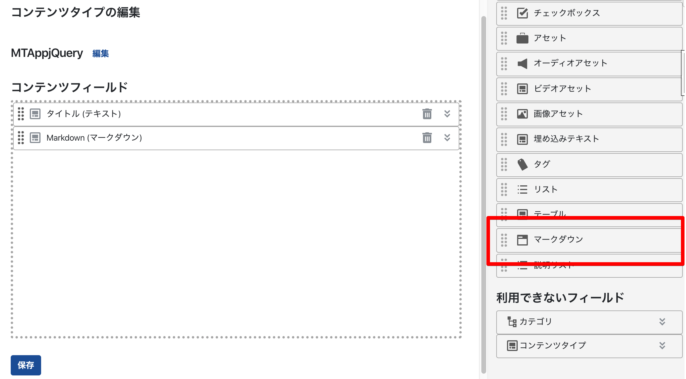

# mt-plugin-MarkdownItField

Movable Type 7 ContentField MarkdownIt Plugin

Movable Type 7 のコンテンツフィールドに マークダウン投稿を可能にします。

## Requirement

- Movable Type 7

## Installation

1. Unpack the mt-plugin-MarkdownItField archive.
1. Upload and copy the mt-plugin-MarkdownItField/plugins/MarkdownItField folder to your MT's plugins folder. ( /path/to/mt/plugins )

## How to use

- [コンテンツフィールドプラグイン MarkdownItField 1.0.0 をリリース](https://www.redamoon.net/log/post/000060/)

## License

The MIT License (MIT)